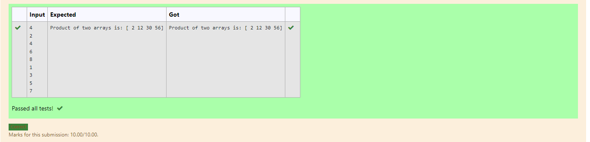

# Multiplying-two-matrix

## AIM:
To write a python program to multiply two arrays using numpy

## ALGORITHM:
## Step 1:
Import numpy as np

## Step 2:
declare a variable array1 as a empty list

## Step 3:
declare a variable array2 as a empty list

## Step 4:
get input value as n

## Step 5:
iterate a variable i in range n by for loop and append the values to the list array 1 end the loop

## Step 6:
iterate a variable j in range n by for loop and append the values to the list array 2 end the loop

## Step 7:
Declare a variable product to array and compute array1*array2

## Step 8:
Print the value of the product
## PROGRAM: 
~~~
import numpy as np
l1,l2 =[],[]
n=int(input())
for i in range(n):
    l1.append(int(input()))
for i in range(n):
    l2.append(int(input()))
value1 = np.array(l1)
value2 = np.array(l2)
result=value1*value2
print("Product of two arrays is:",result)
~~~
## OUTPUT:

## RESULT:
Thus the program for multiplying two arrays runs successfully
